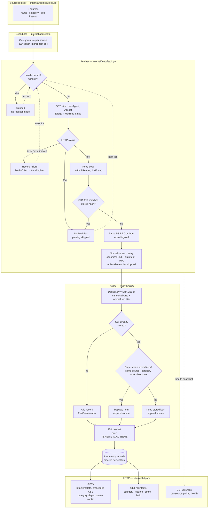

# Tailscale News Aggregator

A small Go service that collects, de-duplicates, ranks, and serves
Tailscale-related news from RSS/Atom feeds, blogs, release notes, and community
sources. It runs as a single static binary with no runtime dependencies.

By Eugene Selivanov · [MIT licensed](LICENSE) · not affiliated with Tailscale Inc.

## Status

Early development. The parts that exist are tested and working; the rest is not
built yet.

| Component | State |
|---|---|
| Configuration (`internal/config`) | Working |
| HTTP server + `/healthz` (`internal/httpapi`) | Working |
| Graceful shutdown, structured logging (`cmd/tailscale-news`) | Working |
| Feed parsing and normalisation (`internal/feed`) | Working — RSS 2.0 and Atom |
| Source registry (`internal/feed/sources.go`) | Working — 5 sources |
| Fetcher: conditional GET, hashing, backoff (`internal/feed/fetch.go`) | Working |
| Scheduler: per-source polling (`internal/aggregate`) | Working |
| Storage + de-duplication (`internal/store`) | Working — in-memory |
| News API (`GET /api/items`) | Working |
| Server-rendered HTML page (`GET /`) | Working |

Running the binary today starts an HTTP server, polls all five sources on their
own schedules, and serves the de-duplicated result as both HTML at `/` and JSON
at `/api/items`. Storage is in-memory, so the catalogue is rebuilt from the feeds
after every restart.

## Requirements

- **Go 1.26.8 or newer** — `go.mod` pins the patch version, and the toolchain
  downloads it automatically when `GOTOOLCHAIN=auto` (the default)
- **linux/amd64** — developed under WSL2 on Windows
- No database, no external services, no third-party Go modules

## Install

```bash
git clone https://github.com/eugwind/tailscale-news.git
cd tailscale-news
go build ./...
```

Optional tooling used by the quality gate:

```bash
go install golang.org/x/vuln/cmd/govulncheck@latest
export PATH="$PATH:$(go env GOPATH)/bin"
```

## Run

From source:

```bash
go run ./cmd/tailscale-news
```

As a binary:

```bash
go build -o tailscale-news ./cmd/tailscale-news
./tailscale-news
```

Check that it is alive:

```bash
curl -s http://localhost:8080/healthz
# {"status":"ok","version":"dev","commit":"none"}
```

Then open <http://localhost:8080/> for the news page. The first poll completes a
second or two after startup.

Print build information and exit:

```bash
./tailscale-news --version
# tailscale-news dev (commit none, built unknown)
```

Stop it with `Ctrl+C` or `SIGTERM`. The server stops accepting new connections,
drains in-flight requests, and exits 0 — or force-closes after
`TSNEWS_SHUTDOWN_TIMEOUT`.

## Configuration

All configuration comes from environment variables, read once at startup. Every
value has a working default, so the service runs with no environment set.

| Variable | Default | Meaning |
|---|---|---|
| `TSNEWS_ADDR` | `:8080` | TCP address the HTTP server listens on |
| `TSNEWS_LOG_LEVEL` | `INFO` | `DEBUG`, `INFO`, `WARN`, or `ERROR` (case-insensitive) |
| `TSNEWS_POLL_INTERVAL` | `15m` | How often each source is polled |
| `TSNEWS_FETCH_TIMEOUT` | `30s` | Bound on a single source fetch, including body read |
| `TSNEWS_MAX_CONCURRENCY` | `4` | Maximum sources fetched in parallel |
| `TSNEWS_MAX_ITEMS` | `5000` | Maximum stories retained in memory |
| `TSNEWS_SHUTDOWN_TIMEOUT` | `15s` | Grace period before connections are force-closed |

Durations use Go syntax (`90s`, `15m`, `1h30m`). An invalid value fails startup
with a specific error rather than falling back silently.

`TSNEWS_POLL_INTERVAL`, `TSNEWS_FETCH_TIMEOUT`, and `TSNEWS_MAX_CONCURRENCY` all
take effect at startup. `TSNEWS_POLL_INTERVAL` applies only to sources that do
not set their own interval.

```bash
TSNEWS_ADDR=127.0.0.1:9000 TSNEWS_LOG_LEVEL=debug ./tailscale-news
```

## HTTP API

| Method | Path | Response |
|---|---|---|
| `GET` | `/` | `200` HTML news page, newest first |
| `GET` | `/healthz` | `200` with `{"status":"ok","version":"…","commit":"…"}` |
| `GET` | `/sources` | `200` with per-source polling health |
| `GET` | `/api/items` | `200` with de-duplicated stories, newest first |

Unknown paths return `404`; a wrong method on a known path returns `405`.

### `GET /`

A single server-rendered page listing the stored stories newest first, with
category filter chips (`/?category=security`) and an Auto/Light/Dark theme
selector (`/?theme=dark`). It accepts the same query parameters as `/api/items`
and needs no JavaScript — the CSS and markup are embedded in the binary with
`go:embed`, so there are no static asset routes and nothing to serve from disk.

The theme is resolved server-side and remembered in a `tsnews_theme` cookie
(`HttpOnly`, `SameSite=Lax`, one year). `Auto` follows the operating system via
`prefers-color-scheme`. Theme and category links preserve each other, so
switching one keeps the other.

Feed content is untrusted, so every value is rendered through `html/template`.
Story links carry `rel="noopener noreferrer external"`, and a `javascript:` URL
smuggled into a feed is neutralised by the template rather than becoming a live
link.

### `GET /api/items`

| Parameter | Default | Meaning |
|---|---|---|
| `category` | all | One of `security`, `release-notes`, `official`, `development`, `community`, `third-party` |
| `source` | all | Match stories carried by a named source |
| `since` | all | RFC3339 timestamp; returns stories newer than it |
| `limit` | `50` | Maximum stories returned, capped at `500` |

An unknown category, a non-positive `limit`, or a malformed `since` returns `400`
with a JSON `error` rather than silently returning nothing.

```bash
curl -s 'http://localhost:8080/api/items?category=security&limit=3'
```

```json
{
  "count": 3,
  "total": 398,
  "items": [
    {
      "Source": "Tailscale security bulletins",
      "Category": "security",
      "Title": "TS-2026-011",
      "URL": "https://tailscale.com/security-bulletins#ts-2026-011",
      "Published": "2026-08-18T00:00:00Z",
      "first_seen": "2026-09-18T19:05:15Z",
      "sources": ["Tailscale security bulletins"]
    }
  ]
}
```

`/sources` reports what the scheduler has actually done — useful for spotting a
source that has gone stale or started failing:

```bash
curl -s http://localhost:8080/sources
```

```json
{
  "count": 5,
  "sources": [
    {
      "source": "Tailscale changelog",
      "category": "release-notes",
      "url": "https://tailscale.com/changelog/index.xml",
      "last_attempt": "2026-09-18T13:47:54Z",
      "last_success": "2026-09-18T13:47:54Z",
      "consecutive_failures": 0,
      "last_item_count": 302,
      "supports_conditional_requests": false
    }
  ]
}
```

## How It Works



A failing source only affects its own branch: the scheduler keeps polling the
others, and a success clears the backoff immediately.

### Normalisation

Every entry from every source is reduced to a canonical `feed.Item`: absolute
canonical URL, plain-text title and summary, and a UTC timestamp. Entries whose
link cannot be resolved are skipped rather than failing the whole feed, because
one malformed entry must not cost a source its other items.

URL canonicalisation lower-cases the scheme and host, drops default ports,
`utm_*` parameters and known trackers (`fbclid`, `gclid`, `ref`, …), sorts the
remaining query, and trims trailing slashes. Non-`http(s)` schemes —
`javascript:`, `data:`, `file:` — are rejected outright.

Fragments are deliberately **kept**. The changelog and security-bulletin feeds
give every entry the same path and distinguish them only by fragment
(`/changelog/#2026-09-17-service`), so dropping it would collapse 300+ entries
onto a single URL.

### De-duplication

`Item.DedupKey()` hashes the canonical URL together with the normalised title,
so the same story published on the blog, mirrored by a community post, and
linked from a release note collapses into one entry. `Item.ID()` is a separate,
per-source identity derived from the feed's own GUID, stable across re-polls
even when a summary or date is edited later.

When two sources carry the same story, the store keeps one winner and records
every source that carried it in the `sources` array. The winner is decided by:

1. **Same source** — a re-poll always refreshes the stored content
2. **Category rank** — `security` > `release-notes` > `official` > `development` >
   `community` > `third-party`, so a security bulletin is never displaced by a
   community repost of the same URL
3. **Having a date** — at equal rank, a dated item beats an undated one

Stories are ordered by publication date, falling back to first-seen for the
sources that omit dates. The store holds at most `TSNEWS_MAX_ITEMS` stories and
evicts the oldest first.

### Polling

Each source runs on its own ticker at its own interval, with a small random
delay before the first poll so start-up does not fire every request at once.
Parallelism across all sources is bounded by a semaphore sized to
`TSNEWS_MAX_CONCURRENCY`.

Requests carry a descriptive `User-Agent` and a feed-oriented `Accept` header,
are bounded by `io.LimitReader`, and refuse redirects that downgrade from HTTPS.
Change detection uses `ETag`/`If-Modified-Since` when the source supports them
and a **SHA-256 hash of the response body** when it does not — which is the case
for every `tailscale.com` feed. An unchanged body skips parsing entirely.

A failing source backs off exponentially from one minute to six hours, with
jitter, and is skipped without a request while inside that window. One failing
source never affects the others, and a success clears the backoff immediately.

## Sources

Registered in [internal/feed/sources.go](internal/feed/sources.go); all five were
probed on 2026-09-18.

| Source | Category | Poll | Feed |
|---|---|---|---|
| Tailscale blog | `official` | 30m | `tailscale.com/blog/index.xml` |
| Tailscale changelog | `release-notes` | 30m | `tailscale.com/changelog/index.xml` |
| Tailscale security bulletins | `security` | 10m | `tailscale.com/security-bulletins/index.xml` |
| Tailscale Learn | `official` | 6h | `tailscale.com/learn/index.xml` |
| Tailscale dev blog | `development` | 6h | `tailscale.dev/feed.xml` |

Sources live in code rather than a config file, so a typo fails the build instead
of a poll. `PollInterval` overrides the global `TSNEWS_POLL_INTERVAL`; zero means
the global value applies.

Two things the survey turned up that shape the fetcher: no `tailscale.com` feed
sends `ETag` or `Last-Modified`, so conditional polling is unavailable for four
of the five sources and a stored content hash is needed instead; and the
changelog feed is ~375 KB with 302 entries, so response limits must accommodate it.

## Project Layout

```
cmd/tailscale-news/     entry point: config, wiring, signals — no business logic
internal/
  aggregate/            polling scheduler; later ranking
  config/               environment parsing into a Config struct
  feed/                 fetching, parsing, normalisation, dedup keys, registry
    testdata/           feed fixtures used by the parser tests
  httpapi/              routes, handlers, server timeouts
    templates/          embedded html/template pages
  store/                in-memory storage and the de-duplication merge
.github/                Copilot instructions, prompts, agents, skills, hooks
```

`internal/` is the default home for code. `pkg/` is reserved for anything
intentionally shared outside this repository, and is currently empty.

## Development

### Quality Gate

Run before considering any change complete:

```bash
gofmt -l .          # must print nothing
go vet ./...
go build ./...
go test -race ./...
govulncheck ./...
```

Or use the packaged skill, which runs the gate and then produces a stamped
static binary in `dist/`:

```bash
.github/skills/release-build/scripts/build-release.sh v0.1.0
```

### Testing

Tests use only the standard library, are table-driven, and never touch the
network — HTTP behaviour is exercised with `httptest` and feed parsing with
fixtures under `testdata/`.

```bash
go test ./...                              # quick
go test -race ./...                        # required before merging
go test -run TestParse ./internal/feed     # one area
go test -cover ./...                       # coverage
```

### Checking Sources

The feed health-check skill probes sources for reachability, format, and caching
support without touching the repository:

```bash
.github/skills/feed-health-check/scripts/check-feeds.sh https://example.test/blog/index.xml
```

It reports each URL as `OK`, `MOVED`, `DEGRADED`, or `BROKEN`, with the HTTP
status, content type, size, and whether `ETag`/`Last-Modified` are present.

### Release Build

```bash
CGO_ENABLED=0 GOOS=linux GOARCH=amd64 go build \
  -trimpath -ldflags "-s -w -X main.version=v0.1.0" \
  -o dist/tailscale-news ./cmd/tailscale-news
```

`version`, `commit`, and `buildDate` are injected at link time and reported by
`--version` and `/healthz`.

## AI Agent Configuration

This repository is configured for AI coding agents. The setup lives in
[.github/](.github/) and is documented in [.github/FILES.md](.github/FILES.md):
always-on instructions, Go coding standards scoped to `**/*.go`, task prompts,
specialist agents, packaged skills with scripts, and lifecycle hooks that block
destructive commands and run `gofmt`/`go vet` after every edit.

[AGENTS.md](AGENTS.md) carries the same guidance for agents that read that
convention instead.

The structure of these customization files — instructions, prompts, agents,
skills, and hooks — follows the patterns in
[FY26 Advanced GitHub Copilot Workshop, module 02: VS Code agents](https://github.com/haslam93/FY26---Advanced-GitHub-Copilot-Workshop/tree/main/02-vscode-agents).
The sample files from that workshop were the starting point; the content here has
been rewritten for Go and for this project.

## Design Principles

- **Standard library first** — a dependency must remove real complexity, not
  just typing. There are currently zero third-party modules.
- **Errors are values** — wrapped with `%w`, never a panic outside `main`.
- **Everything is cancellable** — `context.Context` on every I/O path.
- **Untrusted input** — feed content is sanitised before storage and rendered
  through `html/template`.
- **No live network in tests** — fixtures and `httptest` only.

## Roadmap

1. Ranking, with security bulletins weighted above general news
2. Simple search on the page and in the API — a `?q=` filter matching title and
   summary, done server-side over the existing store; at a few hundred stories a
   plain case-insensitive scan is enough, so no index is needed
3. Persistence, if surviving a restart proves worth the dependency
4. Community sources (Reddit, Hacker News), which is where cross-source
   de-duplication starts to earn its keep
5. Explore an Android app reading the existing `/api/items` endpoint — the JSON
   API is already the natural backend, so this is a client question, not a
   service one

### Design note: running the whole service on Android

Rather than an app talking to a hosted instance, the aggregator could run
entirely on the device, with the UI reading from it locally. `internal/feed` and
`internal/store` are pure Go with no OS coupling, so they would port unchanged.
Three constraints decide the shape:

- **Packaging.** Android 10+ refuses to execute a binary from app-writable
  storage, so the standalone binary is not an option. The supported route is
  `gomobile bind`, which compiles the Go packages into a `.so` inside an AAR and
  calls them over JNI.
- **Scheduling.** The per-source `time.Ticker` goroutines will not survive Doze.
  Android's `WorkManager` would have to own the schedule and call a `PollOnce()`
  entry point on each wakeup — an inversion of `internal/aggregate`, though a
  small one, since `Fetch` is already a standalone operation.
- **Storage.** The process is killed routinely, so an in-memory store would
  re-download every feed on each cold start. Persistence stops being optional,
  and the content-hash change detection matters far more on metered data.

Prefer **direct binding over a local HTTP server**: a port on `127.0.0.1` is
reachable by every other app on the device with no origin isolation and no
authentication, and it spends battery serving HTTP to itself. A thin binding
package — `PollOnce() error`, `ListJSON(category string, limit int) string`, the
simple types `gomobile` can marshal — avoids the listening socket entirely. That
is the one legitimate use for `pkg/`, which is reserved for exactly this kind of
external reuse.

Prerequisites, in order: content-hash fix, persistence, binding package, client.
The first two improve the server build as well, so nothing is wasted if this
direction is not pursued.

## Author

Eugene Selivanov

## License

[MIT](LICENSE) © 2026 Eugene Selivanov.

The aggregator links to and quotes short summaries from third-party feeds. Those
articles remain the property of their respective publishers; this licence covers
only the code in this repository.
